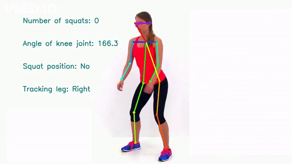

# squat-counter
Using pose-net to count the number of squats done.


# Example


<br>

## Credits for the model implementation [this repo](https://github.com/ildoonet/tf-pose-estimation)

- Implemented the use of posenet model and ran it locally setting up the environment.

## Run
```bash
➜ python squat_counter.py --model=mobilenet_thin --resize=432x368 --leg=right/left(choose) --vidlocation=something.mp4
```

```bash
➜ python bench_press_counter.py --model=mobilenet_thin --resize=432x368 --leg=right/left(choose) --vidlocation=something.mp4
```

## Outputs of the package in terms of body parts
```
0: Nose
1: Sternum
2: Right Shoulder
3: Right Elbow
4: Right Palm
5: Left Shoulder
6: Left Elbow
7: Left Palm
8: Right Hip
9: Right Knee
10: Right Ankle
11: Left Hip
12: Left Knee
13: Left Ankle
14: Right Eye
15: Left Eye
16: Right Ear
17: Left Ear
```